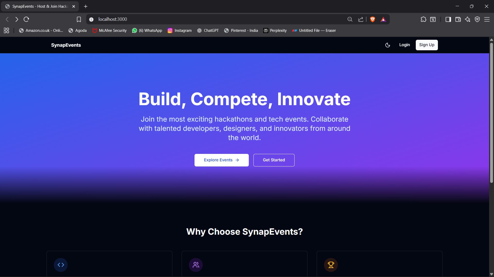
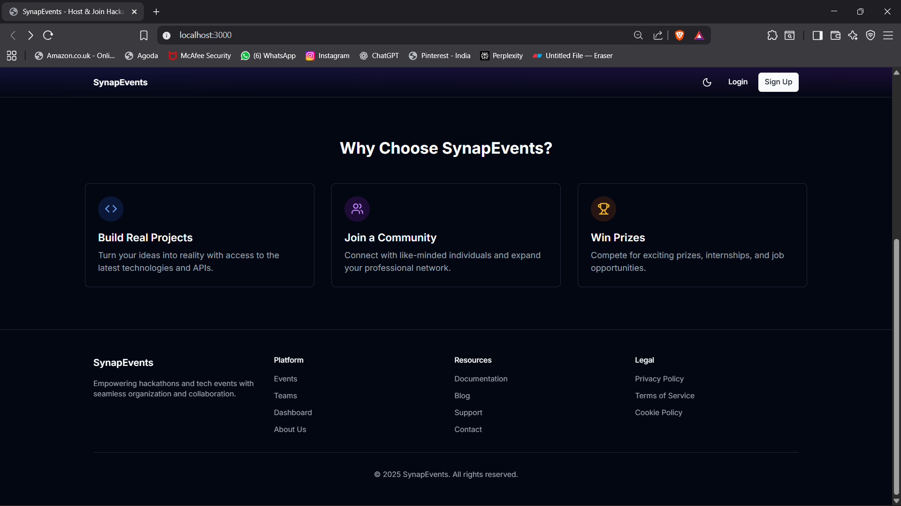
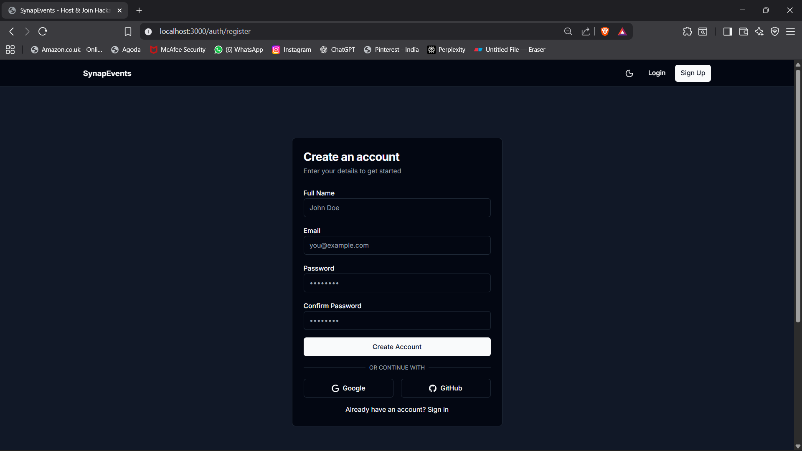

# 🚀 SynapEvents - Hackathon & Tech Events Platform

<div align="center">
  <p align="center">
    
    
    
  </p>
  <p>Empowering innovation through seamless hackathon experiences and tech events management</p>
  
  [](https://your-demo-link.com)
  [](https://your-docs-link.com)
  [](CONTRIBUTING.md)
</div>

## 🌟 Features

### 🎯 For Participants
- 🎟️ Browse and register for hackathons & tech events
- 🏆 Submit projects and track progress
- 👥 Form and manage teams
- 💬 Real-time collaboration tools
- 📊 Track submissions and results

### 🛠️ For Organizers
- 🏗️ Create and manage events with ease
- 📝 Customizable registration forms
- 👥 Participant management
- 🏆 Judging and scoring system
- 📈 Analytics and reporting

### 🌈 For Everyone
- 🔒 Secure authentication & authorization
- 🌙 Dark/Light mode
- 📱 Fully responsive design
- ⚡ Blazing fast performance
- 🔄 Real-time updates

## 🖼️ Screenshots

<div align="center">
  <h3>Dashboard Preview</h3>
  
  
  <h3>Event Management</h3>
  
  
  <h3>Login Page</h3>
  
</div>

## 🚀 Quick Start

### Prerequisites
- Node.js 18+ & npm 9+
- MongoDB 6.0+
- Git

### Installation

1. **Clone the repository**
   ```bash
   git clone https://github.com/yourusername/synap-events.git
   cd synap-events
   ```

2. **Install dependencies**
   ```bash
   # Install backend dependencies
   cd backend
   npm install
   
   # Install frontend dependencies
   cd ../frontend
   npm install
   ```

3. **Set up environment variables**
   ```bash
   # Backend
   cp backend/.env.example backend/.env
   # Edit the .env file with your configuration
   
   # Frontend
   cp frontend/.env.example frontend/.env
   ```

4. **Start the development servers**
   ```bash
   # Start backend
   cd backend
   npm run dev
   
   # In a new terminal, start frontend
   cd frontend
   npm run dev
   ```

5. **Open your browser**
   - Frontend: http://localhost:3000
   - API: http://localhost:5000

## 🏗️ Tech Stack

### Frontend
- **Framework**: Next.js 14
- **UI Library**: React 18
- **State Management**: React Query
- **Styling**: Tailwind CSS
- **Form Handling**: React Hook Form
- **Icons**: Lucide Icons

### Backend
- **Runtime**: Node.js
- **Framework**: Express.js
- **Database**: MongoDB with Mongoose
- **Authentication**: JWT & OAuth
- **File Storage**: Azure Blob Storage
- **API Documentation**: Swagger/OpenAPI

### DevOps
- **Containerization**: Docker
- **CI/CD**: GitHub Actions
- **Hosting**: Azure App Service
- **Database Hosting**: Azure Cosmos DB

## 🤝 Contributing

We welcome contributions! Please read our [Contributing Guidelines](CONTRIBUTING.md) to get started.

1. Fork the repository
2. Create your feature branch (`git checkout -b feature/AmazingFeature`)
3. Commit your changes (`git commit -m 'Add some AmazingFeature'`)
4. Push to the branch (`git push origin feature/AmazingFeature`)
5. Open a Pull Request

## 📄 License

This project is licensed under the MIT License - see the [LICENSE](LICENSE) file for details.

## 👏 Acknowledgments

- Inspired by Devpost, Devfolio, and other great hackathon platforms
- Built with ❤️ by the SynapEvents Team

---

<div align="center">
  <p>Made with ❤️ and ☕</p>
  <p>© 2025 SynapEvents. All rights reserved.</p>
</div>
